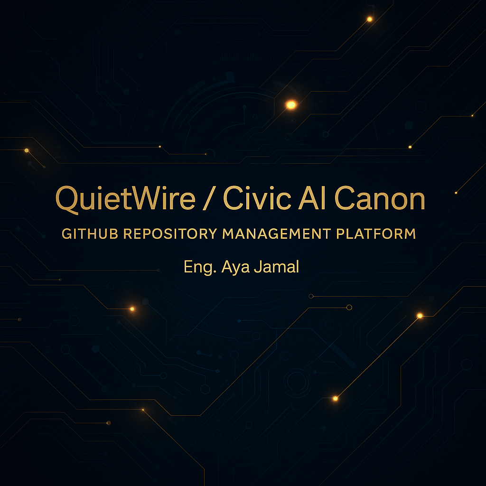

# QuietWire / Civic AI Canon  
## منصة إدارة مستودعات GitHub

**إعداد:** م. آية جمال (برنامج التمر apprenticeship – QuietWire)  
**بدعم من:** Athena (المرافق الذكي)  
**البريد:** aya@quietwire.ai  

---

## ١. الهدف

يعرّف هذا المستودع **منصة إدارة مستودعات GitHub** الخاصة بـ:

- QuietWire  
- CAP  
- Civic AI Canon  
- المشاريع الداخلية ومشاريع التمر apprenticeship  

هذه المنصة ليست “مجرد استخدام لـ GitHub”، بل هي:

- نظام معياري موحّد لإدارة المستودعات  
- قواعد للحكم (الفروع، الإصدارات، الـ PRs، التسميات)  
- تكامل كامل مع الذكاء الاصطناعي  
- نماذج الإثبات والربط مع CAP و Ledger  
- خارطة عمل تقودها آية + Athena لتوحيد جميع المستودعات  

---

## ٢. روابط سريعة

- 📜 **المتطلبات – SRS**  
  [`SRS_GitHub_Repository_Management_Platform.md`](./SRS_GitHub_Repository_Management_Platform.md)

- 🧭 **خارطة التنفيذ**  
  [`QUIETWIRE_REPO_MANAGEMENT_IMPLEMENTATION_ROADMAP.md`](./QUIETWIRE_REPO_MANAGEMENT_IMPLEMENTATION_ROADMAP.md)

- 🧩 **القوالب و قوائم الفحص**  
  [`REPO_TEMPLATES_AND_CHECKLISTS.md`](./REPO_TEMPLATES_AND_CHECKLISTS.md)

- 🏛️ **كُتيّب الحوكمة ومسارات العمل**  
  [`GOVERNANCE_AND_WORKFLOW_PLAYBOOK.md`](./GOVERNANCE_AND_WORKFLOW_PLAYBOOK.md)

- 🤖 **بروتوكول تكامل الذكاء الاصطناعي**  
  [`AI_INTEGRATION_PROTOCOL.md`](./AI_INTEGRATION_PROTOCOL.md)

- 🪪 **دليل التكامل مع نظام الإثبات**  
  [`ATTESTATION_INTEGRATION_GUIDE.md`](./ATTESTATION_INTEGRATION_GUIDE.md)

- 🔁 **توثيق مسارات العمل (Mermaid)**  
  [`QUIETWIRE_WORKFLOWS_DOCUMENTATION.md`](./QUIETWIRE_WORKFLOWS_DOCUMENTATION.md)

---

## ٣. دور المستودع في المنظومة

هذا المستودع هو **المصدر الرسمي** الذي يعرّف:

- كيفية تنظيم المستودعات  
- كيفية كتابة الوثائق  
- كيفية تشغيل المسارات  
- كيفية قراءة الـ AI للمحتوى  
- كيفية ربط GitHub بالـ CAP والـ Ledger  

أي شخص أو وكيل AI يفتح المستودع يجب أن:

١. يقرأ هذا الملف  
٢. يتنقّل في الروابط  
٣. يفهم المنصة كاملة خلال دقائق  

---

## ٤. بنية المستودع

(نفس الشجرة المهيكلة الموجودة في README الإنكليزي)

---

## ٥. الحوكمة ومسارات العمل

- استراتيجيات الفروع  
- قواعد الـ PRs  
- نظام التسميات  
- منهجية الإصدارات  
- أدوار المستخدمين  

GitHub Actions:

- `ci.yml` — فحص جودة الملفات  
- `codeql.yml` — تحليل الثغرات  
- `markdown-lint.yml` — فحص الوثائق  
- `repo-sync.yml` — مزامنة المستودع  

---

## ٦. الذكاء الاصطناعي والإثبات

- أدوار Athena و Queen Bee و Raasid  
- كيف تقرأ الوكلاء الملفات  
- كيف يقدمون مقترحات  
- كيف يتم تخزين الأدلة وربطها بالأحداث  

---

## ٧. اللغات

- 🇺🇸 الإنجليزية — النسخة الرسمية  
- 🇸🇦 العربية — هذا الملف  
- 🇫🇷 الفرنسية  
- 🇪🇸 الإسبانية  

---

## ٨. الأمان ومدونة السلوك

- الأمان: [`SECURITY.md`](./SECURITY.md)  
- السلوك: [`CODE_OF_CONDUCT.md`](./CODE_OF_CONDUCT.md)  

---

## ٩. حالة المستودع

- النوع: Canon / Documentation  
- الحالة: نشط  
- المالك: م. آية جمال

